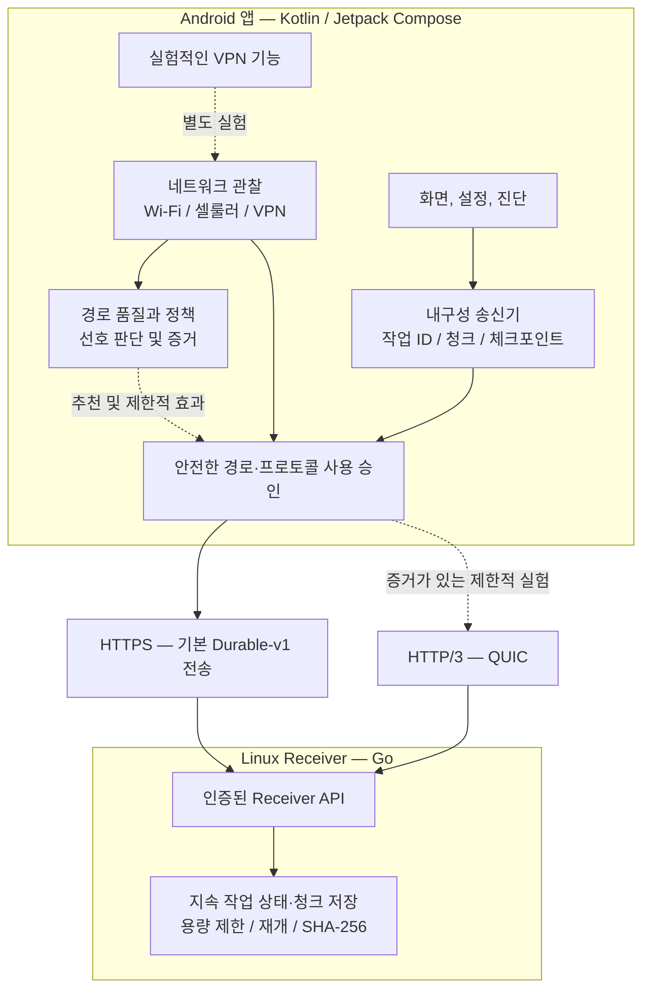

# BetterNet

**불안정하고 느린 네트워크에서도 유용한 작업을 이어가기 위한 프로젝트** — Android를 우선 대상으로 개발 중인 네트워크·내구성 전송 실험 프로젝트야.

[English README](README.md)

> **실제 개발 저장소:** 구현 코드, 테스트, 실험 및 상세 기술 문서는 **[Eun-si123/BetterNet-private](https://github.com/Eun-si123/BetterNet-private)**에서 관리해. 이 저장소는 **비공개**라서 권한이 있는 사람만 내용을 볼 수 있어. 현재 공개 **BetterNet** 저장소는 프로젝트의 공개 소개 공간이며, **소스 코드 미러나 APK 배포 저장소가 아니야.**

## BetterNet이 해결하려는 문제

대역폭이 부족하거나, 지연·지터·패킷 손실이 크거나, 연결이 자주 끊기는 상황에서 **유용한 작업을 끝까지 진행하고 복구하는 것**이 목표야. 성능뿐 아니라 전송 무결성, 재개 가능성, 공정한 기준선 비교, Android와 기존 VPN의 보안 정책을 중요하게 다뤄.

물리적인 대역폭이나 전파 지연을 없애는 기술은 아니고, 모든 앱을 자동으로 가속하거나 외부 앱의 임의 연결을 투명하게 복구하는 완성형 제품도 아니야. **BetterNet이 직접 제어하는 전송**과 **실험적인 Android VPN**은 별개의 기능이야.

## 현재까지 구현한 기능

**2026년 10월 8일 기준:** Phase 0·1은 해당 범위의 실험 증거를 확정했고, Phase 2의 내구성 전송과 Phase 3의 경로 전환은 정해진 검증 범위를 통과했어. **Phase 4 정책·자동 동작은 계속 개발 중**이야. 개별 시험 통과가 모든 기기·네트워크에서의 동작을 보증하는 것은 아니야.

| 영역 | 구현·검증한 내용 | 현재 한계 |
| --- | --- | --- |
| 열악한 네트워크 측정 | 혼잡, RTT·지터, 손실, 처리량, 무결성, 복구에 대한 반복 실험과 기존 방식 대비 비교 | 실험 조건별 결과이며 보편적인 속도 향상 증거는 아님 |
| 내구성 파일 전송 (Phase 2) | Android 송신기와 Linux Go Receiver, 작업 ID, 청크 승인, 체크포인트·재시작 복구, 청크별·전체 SHA-256 검증 | **BetterNet 자체 전송** 대상이며 일반 앱의 모든 통신이나 기기 재부팅 복구까지 보장하지 않음 |
| Receiver 신뢰성 | 저장 상태·용량 제한, 압박 상황에서의 정리, 중복·재시도 안전성, 충돌·재시작 복구 검증 | 권한·저장소·운영 환경 제약이 있음 |
| Android Path Manager (Phase 3) | Wi-Fi·셀룰러·VPN 경로 관찰, 품질 평가, 기본 경로 변경 감지, 진단, 제한적인 선제적 셀룰러 전환 | 기존 VPN·시스템 경로 권한을 존중하며 무제한 멀티패스는 아님 |
| Phase 4 정책 엔진 | AUTO / MAXIMUM_STABILITY 정책, 경로 역할과 기능 증거, 제한적인 재시도·대기 경로 준비 | 일부는 **Shadow(관찰 전용)**이며 정책의 선호만으로 경로 변경 권한이 생기지 않음 |
| QUIC / HTTP/3 | 전송 실험, HTTPS 대체 경로 복구, 증거를 요구하는 제한적 H3 실험 | 모든 전송에 HTTP/3를 자동 사용하는 것은 아님 |
| Android VPN | 실험적인 `VpnService` 데이터 경로 및 벤치마크 | 정식 범용 VPN 최적화 제품으로 제공하지 않음 |
| 진단·업데이트 | 제한된 진단 저널, 경로·전송 상태 기록, APK 무결성 검사, 이어받기·대체 다운로드 코드 | 실제 업데이트 중 연결 중단·복구의 추가 실기기 검증이 남아 있음 |

비공개 개발 저장소에는 Android 소스 버전과 서명된 시험 빌드 배포 상태가 별도로 기록돼 있어. **현재 이 공개 저장소에서 다운로드할 수 있는 공식 APK나 공개 구현 코드는 없어.**

## 시스템 구조

**중요한 구분:** 품질 관찰과 정책 엔진은 전환을 *추천*하고, 실제 전송 경로·프로토콜 선택은 별도의 안전·권한 검사를 거쳐야 해. 성능을 높이려고 기존 VPN을 몰래 우회하지 않아.

### 비공개 개발 저장소 내부 구성

- **`android/`** — Android 앱·UI, 내구성 송신, 경로 관찰, 정책, 진단, 업데이트, VPN·QUIC 실험
- **`core/`** — Go Receiver, 전송 프로토콜, 저장 상태 및 무결성 처리
- **`experiments/`** — 네트워크 품질·프로토콜·혼잡 제어·장애 실험
- **`scripts/`** — 테스트·실험 자동화 도구
- **`docs/`** — 로드맵, 설계 후보, 단계별 증거 및 기술 기록
- **`workplace/`** — 현재 개발 인수인계와 과거 작업 기록

이 폴더들은 **비공개 구현 저장소의 구조를 설명하는 이름**이야. 이 공개 저장소에 같은 폴더나 소스 파일이 들어 있다는 뜻은 아니야.

## 개발 단계

| 단계 | 상태 |
| --- | --- |
| Phase 0 — 타당성·측정 | 해당 범위 실험 완료 및 증거 확정 |
| Phase 1 — 전송 기반 | 해당 범위 전송 실험 완료 |
| Phase 2 — 내구성 전송·재개 | 정해진 복구·무결성 기준 통과 |
| Phase 3 — 경로 관리·전환 | 정해진 실기기 전환 검증 통과, 유지보수 중 |
| Phase 4 — 정책·적응형 동작 | **현재 개발 중**, 안전 기준에 따라 점진적으로 검증 |
| 이후 단계 | 연구·로드맵 후보이며, 출시 기능이 아님 |

## 저장소 이용 안내

- **실제 개발:** [BetterNet-private](https://github.com/Eun-si123/BetterNet-private) — 비공개 저장소. 접근 권한이 없다면 GitHub에서 404가 표시될 수 있어.
- **공개 정보:** 현재 저장소와 [영어 README](README.md).
- **소스·APK:** 현재 공개 저장소에 제공되지 않으며, 이 문서는 설치 가이드가 아니야.
- **검증 기준:** 단위 테스트, 재현 가능한 성능 실험, 실제 Android·네트워크 검증, 서명된 배포물 검증은 각각 다른 증거로 취급해.
- **보안·개인정보:** 실제 서버 주소, 인프라 설정, 비밀키, 원본 로그, 미공개 구현은 비공개로 유지해.

*내용 기준일: 2026-10-08. 비공개 개발 진행에 따라 공개 소개 내용은 늦게 갱신될 수 있으며, 정식 지원 여부는 추후 공개되는 실제 배포물의 검증 결과로 확인해야 해.*
