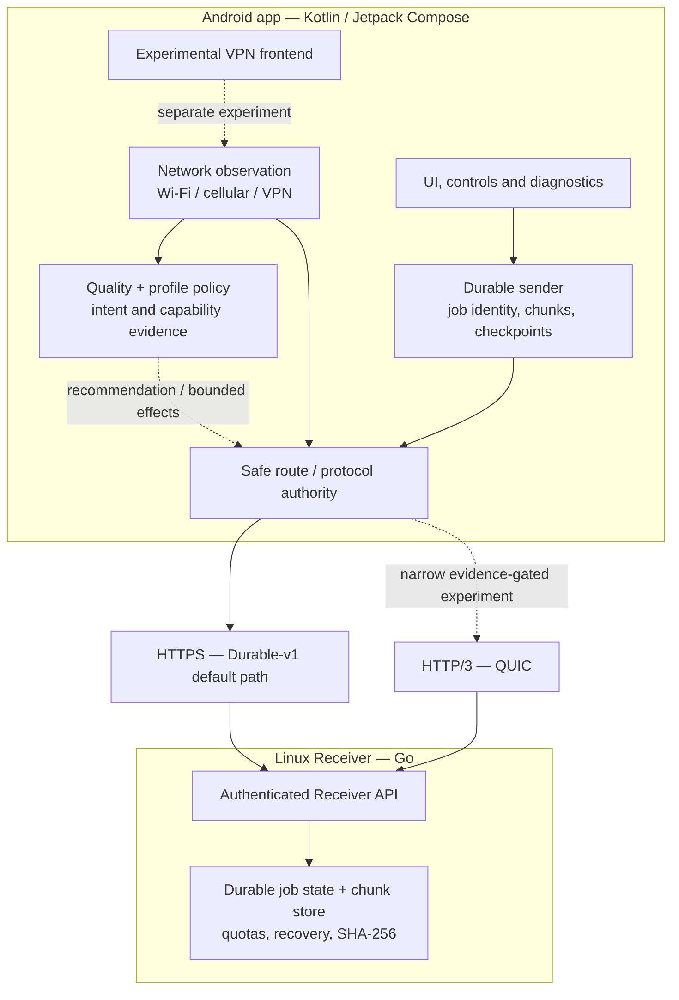

# BetterNet

**Making severely degraded networks more usable** — an experimental, Android-first networking and durable-work project.

[한국어 README](README.ko.md)

> **Where development happens:** The implementation, tests, experiments, and detailed engineering documentation are maintained in **[Eun-si123/BetterNet-private](https://github.com/Eun-si123/BetterNet-private)**. That repository is **private**: only authorized collaborators can access its contents. This public **BetterNet** repository is an overview, **not a source-code mirror or a public download/release channel**.

## What is BetterNet?

BetterNet investigates how useful work can keep progressing on slow, congested, high-latency, lossy, or intermittently disconnected networks. It prioritizes recoverability, accurate measurements, and respect for Android networking and existing VPN/security policies.

It **cannot create bandwidth**, eliminate physical latency, accelerate every application, or transparently resume arbitrary third-party connections. Features that depend on a BetterNet-controlled sender/receiver are distinct from the experimental Android VPN frontend.

## Implementation snapshot

**As of 2026-10-08:** Phases 0–1 have completed their *scoped evidence*; Phase 2 durable-work and Phase 3 path/failover gates passed their defined scopes; **Phase 4 policy/automatic behavior remains active development**. Passing a controlled gate does not mean every deployment, network, or application is supported.

| Area | Implemented / demonstrated | Boundary |
| --- | --- | --- |
| Degraded-network measurement | Repeatable test fixtures for contention, RTT/jitter, loss, throughput, integrity, and failure/recovery comparison; baseline-vs-candidate transport experiments | Results are workload-specific, not universal speed claims |
| Durable file transfer (Phase 2) | Android sender + Linux Go Receiver, persistent job identity, chunk acknowledgments, checkpoint/restart reconciliation, per-chunk and final SHA-256 integrity checks | Works for **BetterNet-owned** transfers; not arbitrary app traffic or device-reboot guarantees |
| Receiver reliability | Bounded persisted metadata and storage quotas, pressure-aware cleanup, safe retry/duplicate handling, and crash/restart recovery tests | Operational configuration, authorization, and storage limits still matter |
| Android Path Manager (Phase 3) | Wi-Fi/cellular/VPN observation, path identity/quality, default-network handoff, diagnostics, and narrowly gated proactive cellular fallback | Respects external VPN/default-path authority; no unrestricted multi-path aggregation |
| Phase 4 policy | Explainable AUTO / MAXIMUM_STABILITY preferences, path roles/capability evidence, constrained retry and standby preparation behavior | Some decisions remain **shadow/observation-only**; preference does not itself authorize a route |
| QUIC / HTTP/3 | Transport experiments, controlled HTTPS fallback, and evidence-gated H3 canary/ordinary-session experiments | Production-adjacent H3 authorization is deliberately narrow, **not general automatic H3 for all transfers** |
| Android VPN | Experimental `VpnService` data path and benchmark tooling | Not presented as a fully supported whole-device optimizer |
| Diagnostics and updater | Bounded diagnostic journal, transfer/path observability, Android update integrity checks, and code for resumable download/fallback | Real interrupted-updater field validation remains pending for the separately distributed update build |

The private project separately records Android source checkpoints and signed test-build distribution. **There is no public APK or implementation source published in this repository at this time.**

## Architecture (conceptual)

**The distinction matters:** measurement and policy *recommend* actions; only explicit safety/authority checks permit a transfer to use a particular network or protocol. BetterNet does not silently bypass an active VPN to chase performance.

### Implementation areas

The working private repository is organized by responsibility:

- **`android/`** — Android client and UI, durable sender, network observation, policy, diagnostics, updater, VPN/QUIC experiments.
- **`core/`** — Go Receiver and durable transfer protocol/state/integrity logic.
- **`experiments/`** — controlled network, transport, congestion, and failure fixtures.
- **`scripts/`** — repeatable local verification and experiment helpers.
- **`docs/`** — roadmap, architecture options, frozen evidence and phase-specific reports.
- **`workplace/`** — active development handoff and historical engineering checkpoints.

These names describe the private implementation layout; **they are not directories available in this public repository**.

## Development phases

| Phase | Current scope/status |
| --- | --- |
| 0 — Feasibility and measurement | Scoped evidence frozen |
| 1 — Transport foundation | Scoped transport evidence frozen |
| 2 — Durable work / resume | Defined durability and restart gates passed |
| 3 — Path manager and failover | Defined physical failover gate passed; maintenance continues |
| 4 — Policy engine and adaptive behavior | **Active**, evaluated incrementally with safety limits |
| Later phases | Research and roadmap candidates, **not shipped features** |

## Availability and accuracy

- **Development:** [BetterNet-private](https://github.com/Eun-si123/BetterNet-private) (restricted access; a GitHub 404 for non-members is expected).
- **Public information:** this repository and its [한국어 README](README.ko.md).
- **Source/binaries:** not currently mirrored or released here; this README is not installation guidance.
- **Validation:** individual automated tests, controlled benchmarks, real Android/network field tests, and signed artifact checks are different evidence categories. Nothing on this page implies universal production readiness.
- **Privacy:** operational endpoints, private infrastructure details, credentials, raw logs, and unreleased implementation remain in the private workspace.

*Snapshot date: 2026-10-08. Public descriptions may lag ongoing private development; availability and supported behavior must be checked against an actual published release when one exists.*
